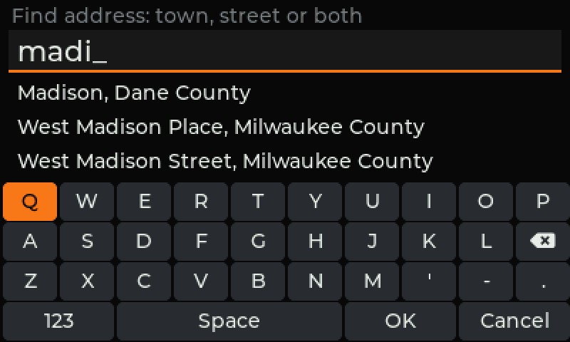
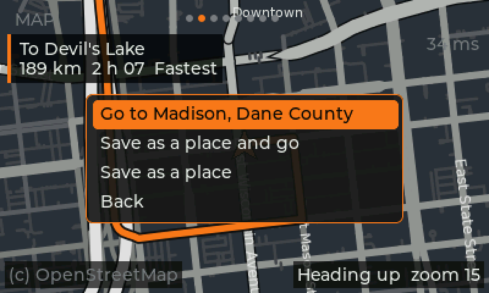
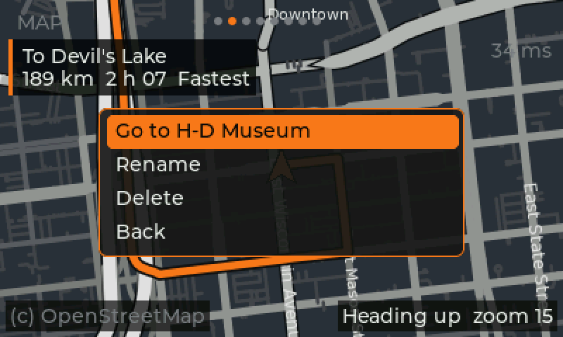
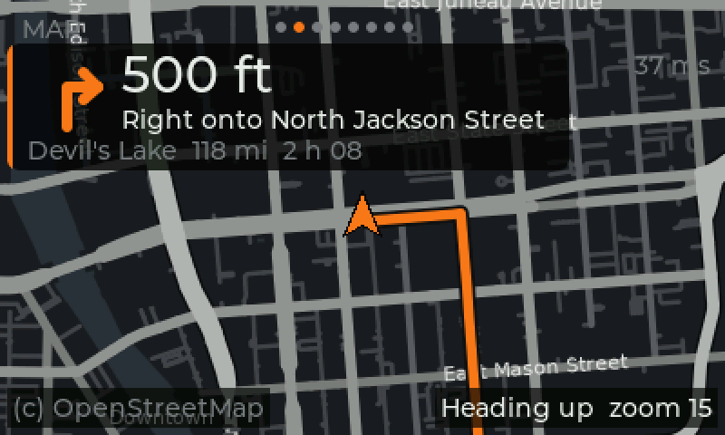

# Offline maps and navigation (plan)

Chosen approach: like stock, the radio carries its own maps and computes
routes itself (no phone needed). Stock uses NNG iGO (QNX binaries, licensed
map data in `/fs/mmc0/nav` on the eMMC, a gyroscope over IOC IPC channel 5
for dead reckoning); none of it can be reused, so HogTiedOS uses open data
and open software:

- **Map data:** OpenStreetMap extracts from Geofabrik (ODbL; credit
  "© OpenStreetMap contributors" on the map page).
- **Engine:** [libosmscout](https://github.com/Framstag/libosmscout): map
  database, AGG renderer (draws into a memory buffer the UI shows), routing
  and turn instructions. Built for phones and small devices.

## Map building (PC)

`tools/maps/build_map.sh NAME GEOFABRIK_PATH` downloads an extract, checks
its md5, converts it with libosmscout's Import and keeps only the runtime
files (listed in the map's `db.json`). Needs libosmscout built in
`build/osmscout-pc` (see below) and these packages:
`libagg-dev libfreetype-dev libprotobuf-dev protobuf-compiler libmarisa-dev`
(plus nlohmann_json, fetched into `build/prefix`).

Only HogTiedOS's minimal content is imported (`tools/maps/make_types.py`
marks the rest of libosmscout's types IGNORE): drivable roads, ferries,
water, borders, place names, addresses, fuel. No buildings, land use,
paths, shops or transit. Harley's own maps are minimal too (greyscale
roads, orange route).

Measured (2026-10-01), Wisconsin (280 MB download):

| Content | Map size | Convert time |
|---|---|---|
| libosmscout default | 332 MB | 3 min 20 s |
| HogTiedOS minimal | **146 MB** | ~1 min 10-35 s |

Most of the minimal map is routing data (`router.dat`, 53 MB) and roads
(`ways.dat`, 42 MB). Trade-off: house numbers that OSM stores on building
outlines (common in the US) aren't searchable; street + town search is.

**North America** (the chosen coverage) is about 60× Wisconsin's download,
so roughly **6-9 GB** of map; converting it on a PC takes hours and ~100 GB
of scratch space. Whether that fits next to Harley's maps depends on the
eMMC's free space (unknown until the unit is up).

A 400×240 frame renders in ~0.1 s on the PC (the radio's Cortex-A8 is
expected to be 10-20× slower: to be measured).

## Map style

`software/maps/hogtied.oss`: minimal, dark greyscale like Harley's maps
(brighter and wider = more important road, slate water, sparse large
labels); the route will be drawn in orange by the UI on top.


## Map page (stage 2)

`software/hbas-map` is a small C interface over libosmscout (open a map,
draw a frame at a position / zoom / rotation into RGB565, map a position to
a pixel). The UI's Map page (right after the dash) draws on a worker thread
into the buffer that isn't on screen and swaps it in, so the UI never
waits; an orange arrow marks the bike; Up/Down zoom (9-17), OK opens the
navigation menu (below); "(c) OpenStreetMap" credit. One frame takes
~15-80 ms on the PC. Notes: a reused libosmscout painter drops street
names from the next frame, so a fresh one is made per frame.


## Routing (stage 3, first part)

`hbas_map_route()` runs libosmscout's router over the same map (the
`router*.dat` / `intersections.*` files the import already makes) and the
route is drawn in orange over the map, under the bike arrow. Routing runs
on the map thread, so the screen keeps moving; Milwaukee to Devil's Lake
(~190 km) takes ~0.5 s on the PC, short trips a few ms.

Route options (the menu's "Route: < >", Left/Right or OK to change; a
route being followed is recalculated):

| Option | How |
|---|---|
| Fastest | typical speeds per road type (libosmscout's demo table) |
| Shortest | distance only |
| No highways | motorways (interstates, freeways) left out of the road set |
| Back roads | motorways / trunks / primaries made "slow", secondary and country roads "fast", so the router prefers them but can still use the big roads |

Distance and time shown are always at typical speeds, whichever option
picked the roads. Milwaukee to Devil's Lake: Fastest 189 km / 2 h 07,
Shortest 183 km / 2 h 26, No highways 192 km / 3 h 03, Back roads
203 km / 3 h 44.

The menu (OK on the Map page):

- *Stop route to ...* (while following one)
- *Find address*: the on-screen keyboard, with up to three suggestions
  that update as you type (below)
- each saved place: OK opens *Go to*, *Rename*, *Delete*
- *Save this spot*: saves where the bike is, then opens the keyboard to
  name it (Cancel keeps "Spot N")
- *Route: < option >*, *Map: Heading up / North up*

Saved places and the route option live in `places.conf` next to the
settings (`/mnt/emmc/hogtied/` on the radio, `~/.config/hogtied/` on a PC;
format in libhbas `places.h`), written the same way as the settings.
`run-ui-on-pc.sh` adds two test places the first time (H-D Museum and
Devil's Lake, WI).

### On-screen keyboard

`ui_kbd.c`: QWERTY plus a 123 page, Space, OK, Cancel, backspace. Touch:
tap keys and suggestions (on the PC the mouse stands in). Handlebar: the
arrows move an orange highlight, OK presses it, Up from the top row goes
into the suggestions, Back cancels. Words get a capital first letter.

The radio's touchscreen is not wired up yet: `hogtied-ui --touch
/dev/input/eventN` reads a Linux touch device, but which controller the
unit has and its calibration (the EEPROM's `touchCal`) are unknown until
we see the hardware.

### Address search (autofill)

`hbas_map_search()` uses libosmscout's location index (towns, streets,
house numbers, fuel stations). What it does on top:

- short forms are spelled out (St, Ave, Rd, Dr, Hwy, N/S/E/W, ...), and a
  house number typed first is moved after the street, as the index wants
- a street with no town typed is looked for in the bike's own region
  (the region of the nearest town)
- towns are names attached to their county in the index; matching ones
  are listed as "Madison, Dane County"
- the index splits several words into town / street guesses and can miss
  the obvious one ("w canal"), so the longest word is searched too and
  everything is ranked: most typed words matched, then towns, then exact
  before partial, then nearest
- OK on the keyboard takes the best match

Each search takes ~5-50 ms on the PC (Wisconsin); it runs on the map
thread and only the newest query is answered. A picked result offers
*Go to*, *Save as a place and go*, *Save as a place*.

The map's content selection (`tools/maps/make_types.py`) now keeps the
county / municipality / suburb boundaries: without them the index had no
regions to put streets in. Wisconsin's cities are mostly not separate
boundaries in OSM, so streets show their county ("West Canal Street,
Milwaukee County").

### Following the route, automatic rerouting

libhbas `route.h` (unit tested): on every GPS fix, the nearest point on
the route line gives the distance off it and the distance remaining. The
banner counts down the remaining distance and time (time scaled from the
route's estimate).

- **Off route:** more than 50 m from the line (plus the fix's error,
  HDOP x 5 m) for 3 fixes in a row: the route is recalculated from where
  the bike is, in the direction it's going, at most every 10 s. If that
  fails the old route stays and it tries again.
- **Arrived:** within 30 m of the route's end: "Arrived at ...", route
  cleared.

### Turn-by-turn (stage 4)

`hbas_map_route()` also keeps the route's manoeuvres
(`hbas_map_route_steps()`), from libosmscout's route description
(postprocessors for names, directions, crossings, motorway junctions and
destinations, then its description generator): turn left / right / slight
/ sharp, roundabout with exit number, onto a motorway, keep left / right
between motorways, exit left / right, arrive. Steps a few metres apart
are merged. Motorways are named by number ("I 39/I 90/I 94"), other
roads by name; an unnamed exit by its destination sign ("Merrimac").

Milwaukee to Devil's Lake, fastest:

```
  0.01 km  left           East Wisconsin Avenue
  0.22 km  right          North Jackson Street
  0.49 km  onto motorway  I 794
116.11 km  keep right     I 39/I 90/I 94
161.91 km  keep right     I 39
162.25 km  exit right     Merrimac
176.68 km  right          County Road DL
183.28 km  right          State Highway 113
183.86 km  left           South Lake Road
189.00 km  arrive
```

The Map page's next-turn panel (top left, replacing the route banner while
following): an arrow for the manoeuvre, the distance to it, what to do
("Right onto East Mason Street", "Roundabout, exit 2 - Main Street",
"Exit right to Merrimac"), then the destination with distance and time
left. Distances follow the bike's unit setting (libhbas
`hbas_nav_distance`, unit tested: "400 ft", "0.3 mi", "450 m", "1.2 km").

Known gap: libosmscout treats a motorway that changes number without a
fork as one road, e.g. it doesn't announce the I 794 to I 94 interchange
in Milwaukee; the panel shows the next manoeuvre it does know (here 115 km
away). Possible fix: announce motorway ref changes ourselves from the
route's way names. Voice prompts wait for the DSP audio link.







## Stages

1. Map pipeline (done for one state).
2. Moving-map page: riding style (dark, bold roads, big names, little
   clutter), centred on GPS, zoom, north-up / heading-up, drawn off the UI
   thread.
3. Routing: route line and options, saved places, on-screen keyboard,
   address search with autofill, managing places, automatic rerouting
   (done). Radio touchscreen: needs the hardware.
4. Turn-by-turn: next-turn panel with distance (done); motorway number
   changes; voice once the DSP audio link exists.
5. On the radio: libosmscout + AGG + FreeType in the image, maps in
   `hogtied/maps/` on the eMMC next to (never replacing) Harley's, speed
   tuning.

## Known issues

- **Water over land on rotated maps with a state extract:** with the
  Wisconsin test map, heading-up frames near Milwaukee fill with water
  colour. Removing water areas from the style removes it, so it's a water
  outline: Lake Michigan, which a single-state extract only contains a
  broken piece of (its outline crosses four states). The North America map
  will have it whole; re-check then. If it remains, use libosmscout's world
  basemap (OSM land polygons) for sea/land.

Open: free space on the eMMC (needs the unit).
