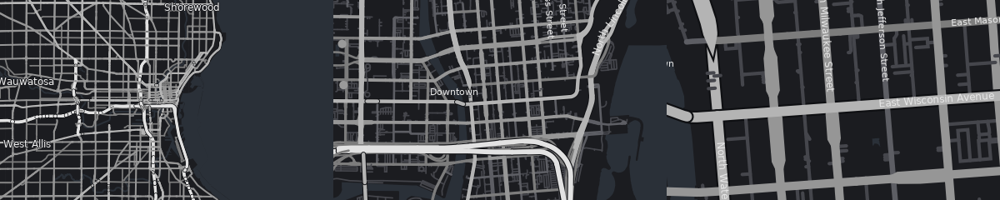
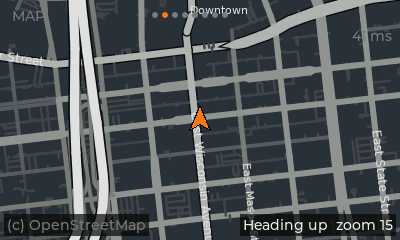
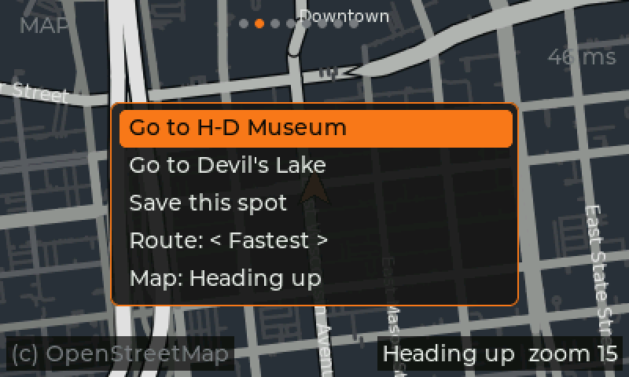
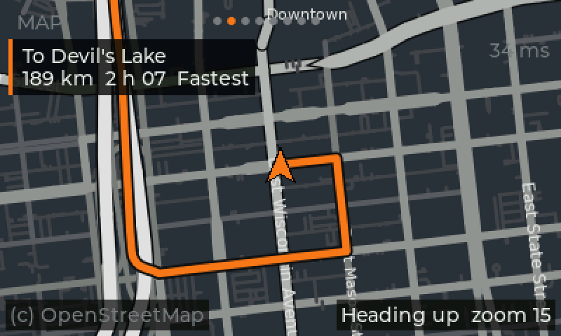

# Offline maps and navigation (plan)

Chosen approach: like stock, the radio carries its own maps and computes
routes itself (no phone needed). Stock uses NNG iGO (QNX binaries, licensed
map data in `/fs/mmc0/nav` on the eMMC, a gyroscope over IOC IPC channel 5
for dead reckoning); none of it can be reused, so HogTiedOS uses open data
and open software:

- **Map data:** OpenStreetMap extracts from Geofabrik (ODbL; credit
  "© OpenStreetMap contributors" on the map page).
- **Engine:** [libosmscout](https://github.com/Framstag/libosmscout): map
  database, AGG renderer (draws into a memory buffer the UI shows), routing
  and turn instructions. Built for phones and small devices.

## Map building (PC)

`tools/maps/build_map.sh NAME GEOFABRIK_PATH` downloads an extract, checks
its md5, converts it with libosmscout's Import and keeps only the runtime
files (listed in the map's `db.json`). Needs libosmscout built in
`build/osmscout-pc` (see below) and these packages:
`libagg-dev libfreetype-dev libprotobuf-dev protobuf-compiler libmarisa-dev`
(plus nlohmann_json, fetched into `build/prefix`).

Only HogTiedOS's minimal content is imported (`tools/maps/make_types.py`
marks the rest of libosmscout's types IGNORE): drivable roads, ferries,
water, borders, place names, addresses, fuel. No buildings, land use,
paths, shops or transit. Harley's own maps are minimal too (greyscale
roads, orange route).

Measured (2026-10-01), Wisconsin (280 MB download):

| Content | Map size | Convert time |
|---|---|---|
| libosmscout default | 332 MB | 3 min 20 s |
| HogTiedOS minimal | **144 MB** | 1 min 34 s |

Most of the minimal map is routing data (`router.dat`, 53 MB) and roads
(`ways.dat`, 42 MB). Trade-off: house numbers that OSM stores on building
outlines (common in the US) aren't searchable; street + town search is.

**North America** (the chosen coverage) is about 60× Wisconsin's download,
so roughly **6-9 GB** of map; converting it on a PC takes hours and ~100 GB
of scratch space. Whether that fits next to Harley's maps depends on the
eMMC's free space (unknown until the unit is up).

A 400×240 frame renders in ~0.1 s on the PC (the radio's Cortex-A8 is
expected to be 10-20× slower: to be measured).

## Map style

`software/maps/hogtied.oss`: minimal, dark greyscale like Harley's maps
(brighter and wider = more important road, slate water, sparse large
labels); the route will be drawn in orange by the UI on top.

## Map page (stage 2)

`software/hbas-map` is a small C interface over libosmscout (open a map,
draw a frame at a position / zoom / rotation into RGB565, map a position to
a pixel). The UI's Map page (right after the dash) draws on a worker thread
into the buffer that isn't on screen and swaps it in, so the UI never
waits; an orange arrow marks the bike; Up/Down zoom (9-17), OK opens the
navigation menu (below); "(c) OpenStreetMap" credit. One frame takes
~15-80 ms on the PC. Notes: a reused libosmscout painter drops street
names from the next frame, so a fresh one is made per frame.

## Routing (stage 3, first part)

`hbas_map_route()` runs libosmscout's router over the same map (the
`router*.dat` / `intersections.*` files the import already makes) and the
route is drawn in orange over the map, under the bike arrow. Routing runs
on the map thread, so the screen keeps moving; Milwaukee to Devil's Lake
(~190 km) takes ~0.5 s on the PC, short trips a few ms.

Route options (the menu's "Route: < >", Left/Right or OK to change; a
route being followed is recalculated):

| Option | How |
|---|---|
| Fastest | typical speeds per road type (libosmscout's demo table) |
| Shortest | distance only |
| No highways | motorways (interstates, freeways) left out of the road set |
| Back roads | motorways / trunks / primaries made "slow", secondary and country roads "fast", so the router prefers them but can still use the big roads |

Distance and time shown are always at typical speeds, whichever option
picked the roads. Milwaukee to Devil's Lake: Fastest 189 km / 2 h 07,
Shortest 183 km / 2 h 26, No highways 192 km / 3 h 03, Back roads
203 km / 3 h 44.

The menu (OK on the Map page): *Stop route*, *Go to* each saved place,
*Save this spot* (saved as "Spot N" for now), the route option, and
heading-up / north-up. Saved places and the route option live in
`places.conf` next to the settings (`/mnt/emmc/hogtied/` on the radio,
`~/.config/hogtied/` on a PC; format in libhbas `places.h`), written the
same way as the settings. `run-ui-on-pc.sh` adds two test places the first
time (H-D Museum and Devil's Lake, WI).

Still to do in stage 3: an on-screen keyboard (touch and handlebar
buttons) to name places and to enter addresses, address search with
autofill from libosmscout's location index (`location.idx`, already in the
map), and managing (renaming / deleting) saved places.

## Stages

1. Map pipeline (done for one state).
2. Moving-map page: riding style (dark, bold roads, big names, little
   clutter), centred on GPS, zoom, north-up / heading-up, drawn off the UI
   thread.
3. Routing: route line and options, saved places (done); on-screen
   keyboard, address search with autofill, managing places (next).
4. Turn-by-turn: next-turn panel, distance, rerouting. Voice once the DSP
   audio link exists.
5. On the radio: libosmscout + AGG + FreeType in the image, maps in
   `hogtied/maps/` on the eMMC next to (never replacing) Harley's, speed
   tuning.

## Known issues

- **Water over land on rotated maps with a state extract:** with the
  Wisconsin test map, heading-up frames near Milwaukee fill with water
  colour. Removing water areas from the style removes it, so it's a water
  outline: Lake Michigan, which a single-state extract only contains a
  broken piece of (its outline crosses four states). The North America map
  will have it whole; re-check then. If it remains, use libosmscout's world
  basemap (OSM land polygons) for sea/land.

Open: free space on the eMMC (needs the unit).
