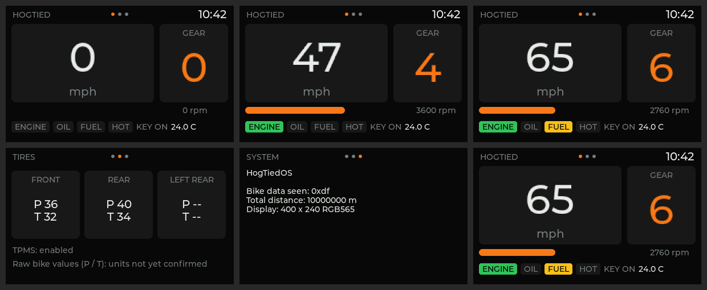

# HogTiedOS userspace

| Directory | What |
|---|---|
| `libhbas/` | C decoder for the bike's CAN messages, field for field from Harley's own `vehicleCAN.lua` (`docs/findings/CROSS_CHECKS.md` sec. 11). No UI or I/O. |
| `hogtied-ui/` | The main screen, 400x240, LVGL 9.2.2: speed, gear, rpm, warning lights, clock, ambient temperature, tire data. |
| `iocd/` | `hbas-iocd`: the IOC link on the unit. Answers the power keep-alive, handles shutdown, and forwards bike CAN frames to `vcan0` for the UI. |

Both are built into the image by Buildroot (`buildroot-external/package/hogtied-ui`).



## Developing on a PC

```sh
# decoder unit tests
cmake -S software/libhbas -B build/hbas && cmake --build build/hbas && (cd build/hbas && ctest)

# UI: needs an LVGL v9.2.2 source tree
curl -L https://github.com/lvgl/lvgl/archive/refs/tags/v9.2.2.tar.gz | tar xz
cmake -S software/hogtied-ui -B build/ui -DLVGL_DIR=$PWD/lvgl-9.2.2 && cmake --build build/ui
build/ui/hogtied-ui --snapshot shot      # writes shot-*.bmp from a scripted demo ride
```

`--snapshot` runs a built-in demo ride on a virtual clock and saves screenshots,
so no display is needed. Built with `-DHOGTIED_FBDEV=ON`, it drives
`/dev/fb0` instead:

- `--demo`: the scripted ride. **Never use this on a bike.** It shows fake data.
- `--replay FILE`: lines like `541#0BB803E800000300` (candump -L style)
- `--can vcan0`: live frames from Linux SocketCAN (a `vcan` interface on a PC)
- `--stdin-keys`: `a`/`d` change pages, `q` goes back (e.g. over the UART console)

## What's real and what isn't yet

- **Real:** decoding. Every field layout comes from the stock decoder, and the
  tests cover each message, error values and short frames.
- **Written, not hardware-tested:** the IOC link (`libhbas/ioc.c` + `iocd`).
  The protocol is verified against stock `dev-ipc` and the stock Lua services
  (CROSS_CHECKS sec. 12), and the tests run against a simulated IOC. On the
  unit: `hbas-iocd` → `vcan0` → `hogtied-ui --can vcan0`. Unknown until
  hardware: the REQ/ACK edge polarity (both edges are used).
- **Shown raw on purpose:** gear numbers, and tire pressure/temperature. The
  stock code doesn't define their meanings or units, so the UI doesn't
  guess.
- **Buttons, written, not hardware-tested:** channel-3 handlebar and
  front-panel buttons are decoded with the stock key map (CROSS_CHECKS
  sec. 13) and appear as the `hbas-buttons` keyboard. The UI pages with
  either handlebar's left/right, and HOME goes back. Run `hbas-iocd -v` to
  log raw button bytes and confirm layout A on the first hardware run.
