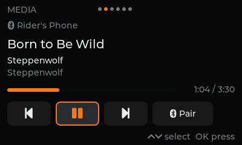
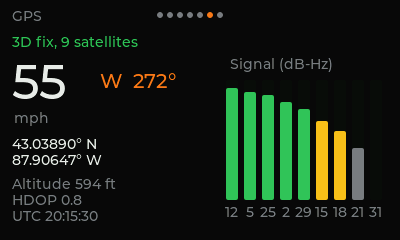
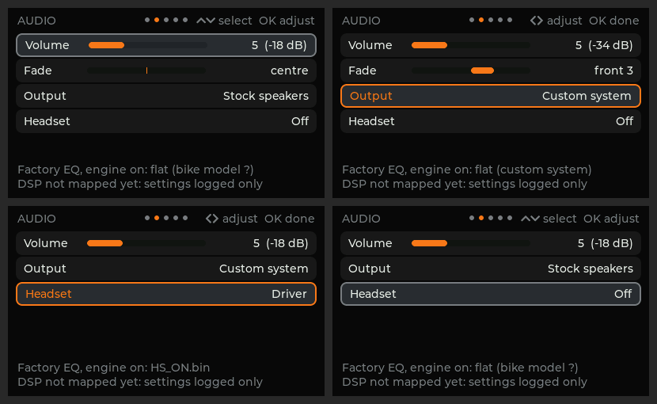
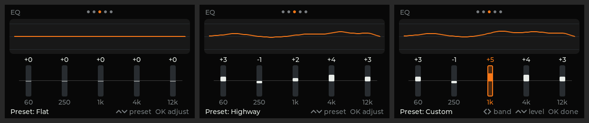
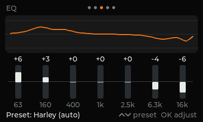

# HogTiedOS userspace

| Directory | What |
|---|---|
| `libhbas/` | C decoder for the bike's CAN messages, field for field from Harley's own `vehicleCAN.lua` (`docs/findings/CROSS_CHECKS.md` sec. 11). No UI or I/O. |
| `hogtied-ui/` | The main screen, 400x240, LVGL 9.2.2: speed, gear, rpm, warning lights, clock, ambient temperature, tire data. |
| `btd/` | `hbas-btd`: phone music over Bluetooth. Talks to BlueZ (connected phone, AVRCP track info and play/pause/next/previous, pairing confirmation) and gives the UI a one-line text protocol (`libhbas/btproto.h`). |
| `gpsd/` | `hbas-gpsd`: the u-blox GPS on UART2. Finds the receiver's baud rate (stock's 9600 → PUBX,41 → 57600 first), parses NMEA, serves the fix to the UI, sets the clock from GPS time. |
| `hbas-map/` | Offline map drawing and routing for the Map page: a C interface over libosmscout (docs/NAVIGATION.md). |
| `maps/` | `hogtied.oss`, the greyscale map style. |
| `iocd/` | `hbas-iocd`: the IOC link on the unit. Answers the power keep-alive, handles shutdown, and forwards bike CAN frames to `vcan0` for the UI. |

Both are built into the image by Buildroot (`buildroot-external/package/hogtied-ui`).












## Running the screen on your PC

One-time setup (Ubuntu / Debian / Pop!_OS):

```sh
sudo apt install build-essential cmake pkg-config curl libsdl2-dev
```

Then, from the repository folder:

```sh
software/run-ui-on-pc.sh
```

The first run downloads LVGL and builds (a minute or two); later runs start
right away. A window opens with the screen at 2x size, playing a demo ride.

| Key | Does |
|---|---|
| Left / Right arrows | change page (Dash, Audio, EQ, Tires, System) |
| Up / Down | Audio: pick a setting. EQ (7 bands, the only tone control): change preset, or a band's level while adjusting |
| Enter | start / finish adjusting (Audio: Left/Right change the value; EQ: Left/Right pick the band) |
| Esc | back to Dash (or finish adjusting) |
| close the window, or Ctrl+C in the terminal | quit |

Your settings (volume, fade, output, headset, EQ) are remembered between
runs in `~/.config/hogtied/settings.conf` (`--settings FILE` to use another
file). It's plain text; delete it to go back to the defaults.

**Media page** (right after the dash): pair your phone with the PC the
usual way, play music on it, and the page shows the track; Up/Down pick
previous / play-pause / next / Pair, Enter presses. (Needs `libdbus-1-dev`;
the PC's own Bluetooth plays the sound.)

`--bike N` pretends the bike reported configuration N (e.g. `--bike 2` =
OE FLTR, `--bike 9` = 2-speaker Tri Glide): the System page shows the model,
the trike tire layout and speaker count follow, and the EQ page's **Harley**
preset shows that bike's factory tone, changing as you change the volume.

Other data sources: `software/run-ui-on-pc.sh --replay FILE` (lines like
`541#0BB803E800000300`, candump -L style) or `--can vcan0` (live Linux
SocketCAN). **Never run `--demo` on a bike**: it shows fake data.

## Developer builds

```sh
# decoder/protocol unit tests
cmake -S software/libhbas -B build/hbas && cmake --build build/hbas && (cd build/hbas && ctest)

# offline screenshots (no display needed): writes shot-*.bmp from the demo ride
cmake -S software/hogtied-ui -B build/ui -DLVGL_DIR=$PWD/build/lvgl-9.2.2 && cmake --build build/ui
build/ui/hogtied-ui --snapshot shot
```

Backends: `-DHOGTIED_SDL=ON` desktop window, `-DHOGTIED_FBDEV=ON` Linux
framebuffer (what the head unit uses), neither = snapshot only. On the unit,
buttons arrive from hbas-iocd as the `hbas-buttons` input device;
`--stdin-keys` also accepts a/d/w/s/Enter/q from a terminal.

## What's real and what isn't yet

- **Real:** decoding. Every field layout comes from the stock decoder, and the
  tests cover each message, error values and short frames.
- **Written, not hardware-tested:** the IOC link (`libhbas/ioc.c` + `iocd`).
  The protocol is verified against stock `dev-ipc` and the stock Lua services
  (CROSS_CHECKS sec. 12), and the tests run against a simulated IOC. On the
  unit: `hbas-iocd` → `vcan0` → `hogtied-ui --can vcan0`. Unknown until
  hardware: the REQ/ACK edge polarity (both edges are used).
- **Audio: settings only, nothing reaches the DSP yet.** The Audio page uses
  the stock ranges and step-to-dB tables, and the EQ profile follows the
  engine. Each change logs the exact DSP writes it would make (addresses and
  words from static analysis of Harley's audio service, `libhbas/dsp.c`,
  `docs/findings/AUDIO.md` sec. 7); they aren't sent until a DSP SPI writer
  exists and the map is confirmed on hardware. Output chooses **Stock speakers**
  (Harley's factory EQ and volume curve) or **Custom system** (aftermarket
  speakers/amp: factory EQ bypassed, volume tops out at 0 dB so the amp gets
  a clean signal). Headset routes media to the Harley comm headset jacks.
  **Speed volume** (on/off) raises the volume with road speed on Harley's
  own curve.
  `--speakers 2` simulates a 2-speaker stock bike (no fade).
- **Settings are remembered** (`libhbas/settings.c`, `hogtied-ui/src/persist.c`):
  a small text file, saved 2 s after the last change and on exit, written
  atomically (temp file, fsync, rename), so a power cut leaves the old or
  the new file, never a broken one. A damaged or unknown file falls back to
  defaults key by key. Mute and the speaker count aren't saved. On the unit
  the file is `/mnt/emmc/hogtied/settings.conf` on the eMMC's FAT32
  partition, which `S30emmc` mounts **read-only**; the UI remounts it
  read-write only for the few milliseconds of a save. Nothing outside the
  `hogtied/` folder is ever written (the stock apps/nav/speech files there are
  left alone). Written and tested on the PC (including the read-only remount,
  in a mount namespace), not yet on hardware.
- **Bike detection, written, not hardware-tested:** hbas-iocd catches the
  bike configuration the IOC sends at startup (DID 0xF1E8) and writes
  `/run/hbas/bike`; the UI picks up the model, speaker count, trike layout
  and factory EQ from it.
- **Bluetooth music, written, tested on the PC (not on the unit):**
  `hbas-btd` is tested against a fake BlueZ (`btd/tests/test_btd.py`:
  track/status updates, every control, pairing accept/reject, bluetoothd
  restart) and end to end with the UI. On the unit it also needs the Bluetooth
  chip brought up (SDIO on MMC3) and the A2DP audio routed to the DSP; see
  `docs/findings/BLUETOOTH.md`.
- **GPS, written, tested on the PC (not on the unit):** NMEA parsing (incl.
  checksums and the GPS week-rollover fix) and the daemon (against a pretend
  receiver on a pseudo-terminal: stock's baud command, locking, bad
  sentences, receiver going quiet). On the PC the GPS page plays a made-up
  demo ride. `docs/findings/GPS.md`.
- **Shown raw on purpose:** gear numbers, and tire pressure/temperature. The
  stock code doesn't define their meanings or units, so the UI doesn't
  guess.
- **Buttons, written, not hardware-tested:** channel-3 handlebar and
  front-panel buttons are decoded with the stock key map (CROSS_CHECKS
  sec. 13) and appear as the `hbas-buttons` keyboard. The UI pages with
  either handlebar's left/right, and HOME goes back. Run `hbas-iocd -v` to
  log raw button bytes and confirm layout A on the first hardware run.
